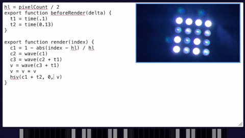

# 3 languages in a trenchcoat

A questionable combination of JavaScript (in syntax), FORTH (in spirit) and MicroPython (in terms of scope and being a wild mix of weird and kinda cool).

## Dear `$deity`, why?

- Hot code reloading on embedded without having to flash a whole new binary: especially on `esp32-idf` image size and thus turnaround time can be a bit of an obstacle.
- Port [Pixelblaze](https://www.bhencke.com/pixelblaze) to Rust.

## See it in action

This is the live code editor (observe changes to the `hsv(...)` call in the last line) + in-browser rendering, alongside hot code reload sent to a `no_std`,`no_alloc` microcontroller.


## Features 

- *extremely* fast turnaround, no noticable delay between code change and web app/mcu update

- Care has been taken to keep runtime platform, language and language dialect generic. This means:
  - runtime: you can run `trenchcoat` on a PC, a microcontroller, or in the browser.
  - language dialect: Pixelblaze-specific JavaScript extensions are factored out and don't pollute the standard JS namespace
  - language: the virtual machine actually executing code is a language-agnostic stack machine, there just happened to be a [JavaScript parser](https://rustdoc.swc.rs/swc_ecma_parser/) lying around. If you want to add, say, Python syntax support, you totally can! I won't! (Pull requests are welcome, though)

## Limitations
- For a few reasons, currently nightly Rust is required.
- Only a very minimal subset of JavaScript and Pixelblaze functionality is supported. You want `for` loops? Maybe in the next release…
- Extremely unoptimized! Also, basically no prior art has been considered so it's probably full of Arrogant Rookie™ mistakes.
- Parsing is not available on microcontrollers (so, no on-device REPL). The architecture allows implementing it, though.
- Without a heap we're forced to use `heapless` collections, and those are unfortunately wasteful for the `trenchcoat` use case.
Therefore as of version `0.5` even the `no_std` STM32F4 app uses an allocator instead. `no_alloc` support *might* be removed at some point, but it's kept around for now.
- The license needs to be piped through a lawyer.

## Enough talking, how do I run this?

Right now the main goal is getting pixelblaze support to mature, so that's also what these instructions will focus on.

The general approach is:

1. Pick a runtime (console/web/embedded) and compile JavaScript/Pixelblaze source to bytecode. Pixelblaze examples can be found in `res/`, though as of version `0.5` only `rainbow melt.js` is verified to work - lots of implementation details are still missing!
2. For embedded only: pick an update path - the web app uses inline compilation + HTTP to UART updates for hot code reload, but if you don't need that, you can also use the bundled `console-compiler` to compile bytecode to disk (`.tcb` for "TrenChcoat Bytecode" is a suggested file extension) and "somehow" have your firmware access it, e.g. via `include_bytes!`. If you want to update via http but your mcu is connected via UART (e.g. the bundled `stm32f4-app`), launch `http-to-serial.py /dev/YOUR-SERIAL-DEVICE` as a bridge.
3. Spawn an `Executor`, `start()` it once and call `do_frame()` as many times as you wish to produce LED colors. On `no_std`, "current time" needs to be advanced manually from some timer source (the example app reuses the frame task's scheduling interval). `Executor::exit()` is optional.

Feature flag sets to pick:
- Desktop: `["full"]`
- Web app/wasm: `["compiler", "log", "use-std"]`
- Embedded: `["defmt"]` or `["defmt", "alloc"]` when you have an allocator
  - esp32 with IDF (`std` support): `["log", "use-std"]`

(note: logging is entirely defunct at the moment until I fix the macros)

### WeAct STM32F4x1 aka "USB-C pill", "black pill" 

- you need a working hardware probe + `probe-run` setup.
- the example app uses SPI2 on PB15 with 16 WS2812 LEDs. Most heavy LED lifting is done in the adjacent `f4-peri` crate; you can also use SPI1+PB5 by using the `spi` feature instead of the default `spi_alt`. `f4-peri` also supports the SK9822/APA102 protocol if you prefer a more stable LED.

```shell
cd console-compiler
cargo run -- -f pixelblaze -i ../res/rainbow\ melt.js -o "../res/rainbow melt.tcb" 
cd ../stm32f4-app
# probe-run is required
cargo rrb app
```

at this point you can either send the `.tcb` data over via `cat ../res/rainbow melt.tcb > /dev/<USB UART>`, or spin up the web code editor & python web-to-uart bridge for live editing fun!

#### Help, the app crashes saying the heap is too damn full!

try increasing `HEAP_SIZE` in `src/bin/app.rs`.

### Espressif C3

Package directory: `esp32-c3-app`

You need a working Espressif native toolchain installation - more details [here](https://esp-rs.github.io/book/).

copy `config.toml.example` to `config.toml` and edit your wifi & LED settings. The current firmware supports WS2812 and APA102/SK9822 LED protocols via features `ws2812` (data pin only) and `apa102` (clock and data pins) respectively. 

Build, flash and run using `cargo espflash --release --monitor /dev/<ESP UART HERE> --features WS_OR_APA`. The station (device) IP will be printed on successfully joining the wifi network. Put this IP in the web app `config.toml` list of `endpoints=` and start the web app (or use `console-compiler` & `curl` to POST new bytecode to `http://<station ip>/`).

### Espressif S2

Should not be too much work to port since the C3 app uses `esp-idf`, any takers?

### Raspberry Pi Pico
TODO, up next!
### Browser/live code editor

(*a cool bear spawns from an adjacent universe*)

**cool bear:** Browser? As in ... you're running a rudimentary JavaScript virtual machine ... in the browser ...

**author, in straightjacket:** you got that exactly right. With no performance-boosting offload support whatsoever!

On the bright side, we don't need a separate compilation step as part of our build. 
Because *the compiler also runs in the browser, muahahaha*

#### Configuration

on every change to the code editor window, the web app tries to compile the source to bytecode and broadcasts it to all configured endpoints. 
Copy `web-app/config.toml.example` to `web-app/config.toml` and set:
- `endpoints`: list of bytecode recipients - `http://localhost:8008/` is the listen address of `http-to-serial.py` in case your target does not have its own web server. Note: if you build your own web server, it must offer at least minimal CORS support (see `http-to-serial.py` for further details)
- `pixel_count`: number of LEDs to render in-browser
- `initial_js_file`: initial contents of the editor window, populated via `build.rs`

#### running

- You might need to install "wasm stuff" for Rust first.
- the web app is written in [Dioxus](https://dioxuslabs.com/), a react-like framework in Rust. It needs `dioxus-cli` to run.

```shell
cargo install --git https://github.com/DioxusLabs/cli # their stable version seems broken atm
cd web-app
dioxus serve
$browser http://localhost:8080/
```

## Acknowledgements
- Forth-ish VM inspired by [forth-rs](https://github.com/dewaka/forth-rs) 
- Abstract (`log`/`defmt`) logging macros courtesy of [dirbaio](https://github.com/Dirbaio) and [whitequark](https://github.com/whitequark)
- Cool Bear™ by [fasterthanlime](https://fasterthanli.me/)

## Resources
[Pixelblaze expression language](https://github.com/simap/pixelblaze/blob/master/README.expressions.md)
